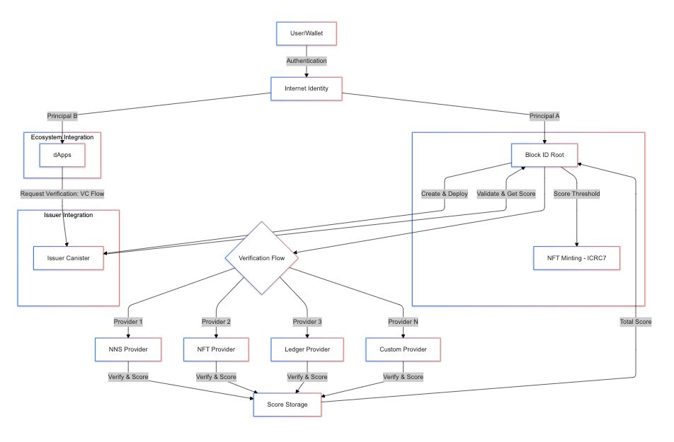

# BlockID - Decentralized Identity Verification Platform

BlockID is a decentralized identity and reputation protocol built on the Internet Computer, enabling users to build and verify their Web3 identity through various on-chain activities and Verifiable Credentials.

Key Features:
- Decentralized identity verification using VC Flow
- Customizable verification rules and scoring system
- Remote Provider integration framework
- Built-in providers for common verification needs
- Comprehensive trust scoring system



## Introduction

BlockID solves the identity verification challenge in Web3 through:
- VC Flow integration for secure credential verification
- Extensible provider framework for custom verification logic
- Bridge architecture between Rust and Motoko for optimal performance
- Remote provider system for external project integration


This project is a part of the [ICTO](https://icto.app) ecosystem. 

BlockID has also received a grant from the [Dfinity Grant Program](https://dfinity.org/grants).


## Installation

### Prerequisites
- Node.js 16+
- Rust toolchain
- DFX 0.14.1+
- Internet Computer SDK

### Local Development Setup

1. Clone repository:
```bash
git clone https://github.com/ICTO-Labs/BlockID
cd BlockID
```

2. Install dependencies:
```bash
npm install
cd src/rust/issuer && cargo build
cd ../validate && cargo build
```

3. Start local replica:
```bash
dfx start --background
```

4. Deploy canisters:
```bash
./scripts/deploy.sh local
```

## Canister Structure

### Backend Canister (Motoko)
- Core business logic
- Provider management
- Score calculation
- User verification

### Issuer Canister (Rust) 
- VC Flow Issuer implementation
- Credential issuance
- Verification status management

### Validate Canister (Rust)
- VC Flow validation
- Bridge between Motoko and VC Flow
- Credential verification

### Frontend Canister
- Vue 3 application
- Provider management interface
- Verification flow UI
- Dashboard and monitoring

### Whitelist Canister
- Demo Remote Provider implementation
- Example for custom provider integration

## Deployment

### Production Deployment
```bash
./scripts/deploy.sh ic
```

### Individual Canister Deployment

1. Deploy Issuer:
```bash
./scripts/deploy-issuer-canister.sh --dfx-network ic
```

2. Deploy Validator:
```bash
./scripts/deploy-validate-canister.sh
```

3. Deploy Backend:
```bash
dfx deploy backend --network ic
```

4. Deploy Frontend:
```bash
dfx deploy frontend --network ic
```

## Documentation
Full documentation available at: https://blockid.cc/docs or [ICTO Docs](https://docs.icto.app/block-id/about)


## Roadmap
- [x] VC Flow integration
- [x] Provider framework
- [x] Remote provider system
- [x] Bridge architecture
- [ ] Native Motoko VC Flow support
- [ ] Enhanced security measures


## License
MIT License

## References
- [Quick Start](https://internetcomputer.org/docs/current/developer-docs/setup/deploy-locally)
- [SDK Developer Tools](https://internetcomputer.org/docs/current/developer-docs/sdk-reference/cli)
- [Motoko Programming Language Guide](https://internetcomputer.org/docs/current/motoko/main/motoko)
- [VC Flow Documentation](https://internetcomputer.org/docs/current/references/vc-spec/)
- [BlockID Forum Post](https://forum.dfinity.org/t/blockid-one-id-infinite-trust/36740)