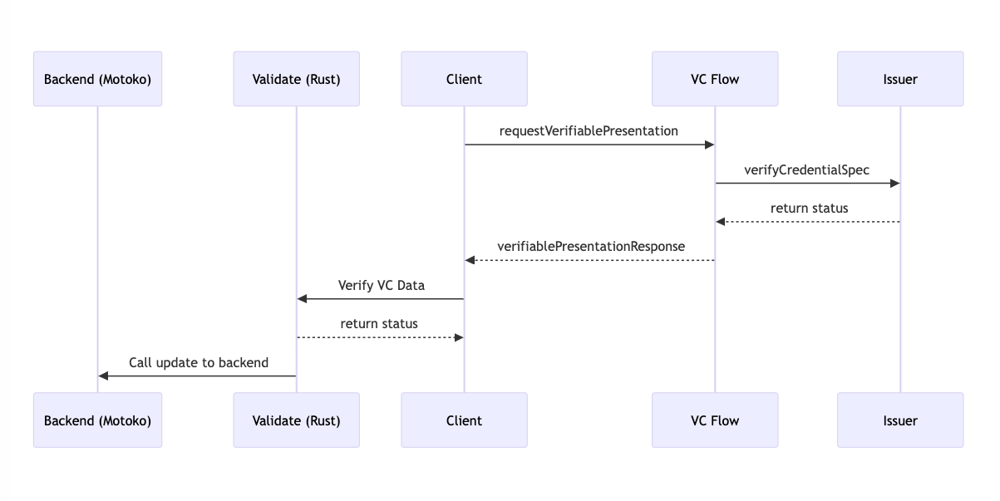
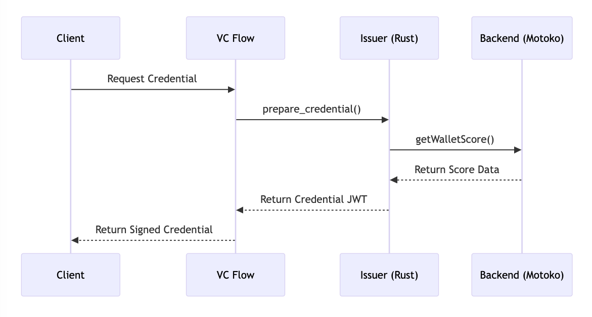

# Rust-Motoko Integration for Verifiable Credentials

The validation process involves multiple components working together to verify and process Verifiable Credentials (VC) data. This flow ensures secure and reliable verification of user credentials before updating the backend system.

Source code:
 - Validate canister: [validate](src/rust/validate)
 - Issuer canister: [issuer](src/rust/issuer)
 - Backend canister: [backend](../backend)

## Validation Flow

The validation process involves multiple components working together to verify and process Verifiable Credentials (VC) data. This flow ensures secure and reliable verification of user credentials before updating the backend system.



### Detailed Flow Description

#### 1. Initial VC Request
- Client initiates the flow by requesting a Verifiable Presentation from VC Flow
- Endpoint: https://identity.ic0.app/vc-flow
- This step begins the credential verification process

#### 2. Credential Specification Verification
- VC Flow communicates with the Issuer to verify credential specifications
- The Issuer validates the credential requirements and parameters
- Returns verification status to VC Flow

#### 3. VC Flow (Internet Identity) Response
- VC Flow processes the Issuer's response
- Generates a Verifiable Presentation
- Returns the presentation to the client

#### 4. Validation Through Rust Bridge

When client  receives the presentation, it will call the validate canister to validate the presentation to get the validation result.
```rust
async fn validate(req: ValidateVpRequest) -> Result<(), String> {
       // Validate the VP JWT and claims
       match validate_ii_presentation_and_claims(
           &req.vp_jwt,
           req.effective_vc_subject,
           &vc_flow_signers,
           &req.credential_spec,
           &ic_root_key_raw,
           time() as u128,
       ) {
           Ok(()) => {
               // Forward validation data to Motoko backend
               let validate_data = req.validate_data;
               call_remote_canister(validate_data).await
           },
           Err(err) => Err(format!("VP validation error: {:?}", err))
       }
   }
```
#### 5. Backend Update Through Motoko
Create a motoko canister that will be called by the validate canister (rust) to update the backend.
```motoko
public func _verifyFromVC({
    application_id: Text;
    validator_id: Text;
    criterial_id: Text;
    wallet_id: Text;
}) : async Result.Result<Bool, Text> {
    let walletId = Principal.fromText(wallet_id);
    
    switch (applications.get(application_id), validators.get(validator_id)) {
        case (?_, ?validator) {
            // Update wallet scores and statistics
            updateWalletScore(walletId, application_id, validator_id, [criteriaScore]);
            updateDailyStats(now);
            updateValidatorStats(validator_id, true, vcCriteria.score, now);
            return #ok(true);
        };
        case _ { return #err("Invalid application or validator") };
    };
}
```


## Issuer Flow

### Implementation

Then you can call to add issuers (support multiple issuers):

```bash
DFX_NETWORK="local"
ISSUER_CANISTER_ID="rdmx6-jaaaa-aaaaa-aaadq-cai"

dfx canister call validate add_issuer '(record { issuer = principal "'"$ISSUER_CANISTER_ID"'"; credential_spec = vec {} })' --network "$DFX_NETWORK"
```

### Issuer Flow

The Issuer Flow handles the verification and issuance of Verifiable Credentials based on wallet scores. This process involves interaction between VC Flow, Issuer Canister (Rust), and Backend Canister (Motoko).

See the issuer documentation for more details: [Become an issuer](https://internetcomputer.org/docs/current/developer-docs/identity/verifiable-credentials/issuer)



This follow the documentation from the internet computer. We change the way to get the wallet score from the backend canister only!

### 1. Issuer Canister implementation

The issuer canister is the canister that will be called by the VC Flow to verify the credential specifications.

Update `prepare_credential_jwt` from `src/rust/issuer/src/main.rs`

```rust
async fn prepare_credential_jwt(
    credential_spec: &CredentialSpec,
    alias_tuple: &AliasTuple,
) -> Result<String, IssueCredentialError> {
    match verify_credential_spec(credential_spec) {
        Ok(SupportedCredentialType::VerifiedScore(required_score)) => {
            let _credential = verify_verified_score_principal_registered_and_authorized(
                alias_tuple.id_dapp,
                required_score,
            ).await?;
            Ok(verified_credential(alias_tuple.id_alias, credential_spec))
        }
        Err(err) => Err(err),
    }
}
```

Update `verify_verified_score_principal_registered_and_authorized` from `src/rust/issuer/src/main.rs` and call the backend canister (motoko) to get the wallet score.

```rust
async fn verify_verified_score_principal_registered_and_authorized(
    user: Principal,
    score: i32,
) ->  Result<(), IssueCredentialError> {

    let total_score = get_wallet_score(user, "block-id".to_string())
        .await
        .map_err(|e| IssueCredentialError::Internal(e))?;

    if total_score >= score as u64 {
        Ok(())
    } else {
        Err(IssueCredentialError::UnauthorizedSubject(
            format!("Total score {} is less than required score {}", total_score, score)
        ))
    }
}
```


### 2. Backend Canister implementation

The backend canister is the canister that will be returned the wallet score to the issuer canister.

```motoko
public query func getWalletScore(walletId: WalletId, applicationId: Text) : async {
    primaryScore: Nat;
    linkedScore: Nat;
    totalScore: Nat;
    percentileAbove: Float;
    linkedWallet: ?(WalletId, Nat);
} {
    // Calculate primary score
    primaryScore := _getWalletScore(walletId, applicationId);
    totalScore := primaryScore;
    
    // Check linked wallets
    switch (walletLinks.get(walletId)) {
        case (?link) {
            if (link.primaryWallet == walletId) {
                let secondaryScore = _getWalletScore(link.secondaryWallet, applicationId);
                linkedWallet := ?(link.secondaryWallet, secondaryScore);
                totalScore += secondaryScore;
                linkedScore := secondaryScore;
            };
        };
    };
    
    let percentileAbove = _getPercentileAbove(totalScore);
    return { primaryScore; linkedScore; totalScore; linkedWallet; percentileAbove };
}
```

### 3. Test from client
Use the `@blockid/sdk` to test from the client side.

#### Install the `@blockid/sdk`

```bash
npm install @blockid/sdk
```

#### Quick Start
```typescript
import { BlockID } from '@blockid/sdk';

const blockID = new BlockID({
  host: 'https://icp0.io',// Optional, defaults to https://icp0.io
  appId: 'your-app-id'// Optional, defaults to 'block-id'
});

// Verify with BlockID, ensure your wallet is connected to your dApp
const result = await blockID.verifyScore({required: 10, principal: 'principal-id'});
console.log('Verification result:', result);
```

## References

1. [Verifiable Credentials: How it works](https://internetcomputer.org/docs/current/developer-docs/identity/verifiable-credentials/how-it-works)
2. [Become an issuer](https://internetcomputer.org/docs/current/developer-docs/identity/verifiable-credentials/issuer)
3. [Become a relying party](https://internetcomputer.org/docs/current/developer-docs/identity/verifiable-credentials/relying-party)
3. [Motoko Programming Language Reference](https://internetcomputer.org/docs/current/motoko/main/getting-started/motoko-introduction)
4. [Rust Programming Language Reference](https://internetcomputer.org/docs/current/developer-docs/backend/rust/)


## License
MIT